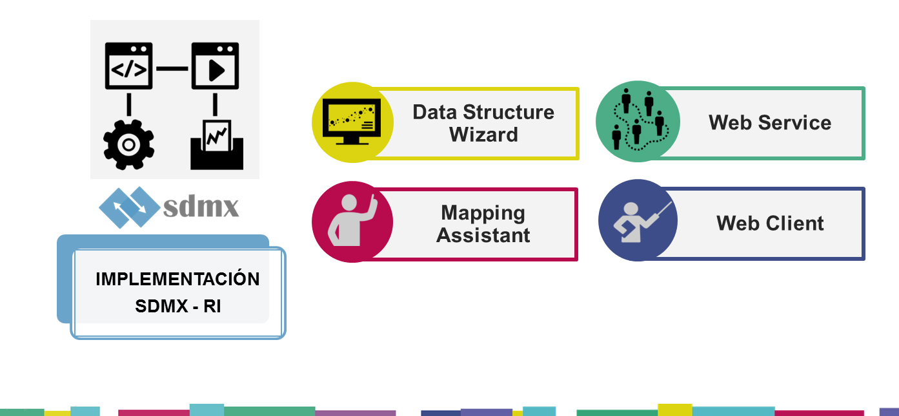

# SDMX-standard

Este repositorio brinda una ayuda tecnológica para la implementación del estándar SDMX, exigido en las entidades públicas gubernamentales para el intercambio y la difusión de información estadística.



<br>

## Comenzando 🚀 

_Estas instrucciones te permitirán obtener una copia del proyecto en funcionamiento en tu máquina local para propósitos de desarrollo y pruebas._

Mira **Despliegue** para conocer como desplegar el proyecto.

<br>

### Pre-requisitos 📋

Se deben descargar previamente las siguientes herramientas tecnológicas 

```
- Data Structure Wizard
- Mapping Assistant
- Web Client
- Web Service
```

<br>

### Instalación 🔧

Las herramientas _Data Structure Wizard_ y _Mapping Assistant_ se deben instalar en un Sistema Operativo Windows

#### Data Structure Wizard

```
-
```

#### Mapping Assistant

```
-
```

<br>

## Despliegue 📦

_El despliegue se puede ejecutar en cualquier Sistema Operativo que tenga Docker y Docker Compose. Preferiblemente Linux_

```
docker-compose up -d
```

<br>

## Construido con 🛠️

* [Docker](https://docs.docker.com/install/) - Docker
* [Docker Compose](https://docs.docker.com/compose/) - Docker Compose

<br>

## Autores ✒️

* **Diego Asencio** - *Trabajo Inicial* - [diegoasencio96](https://github.com/diegoasencio96)

También puedes mirar la lista de todos los [contribuyentes](https://github.com/diegoasencio96/SDMX-standard/graphs/contributors) quíenes han participado en este proyecto. 

<br>

## Licencia 📄

Este proyecto está bajo la Licencia (GNU General Public License v3.0) - mira el archivo [LICENSE.md](LICENSE) para detalles

<br>

## Expresiones de Gratitud 🎁

* Comenta a otros sobre este proyecto 📢
* Invita una cerveza 🍺 a alguien del equipo. 
* Da las gracias públicamente 🤓.
* Ayuda a reportar y/o corregir fallos.

<br>

---
⌨️ con ❤️ por [diegoasencio96](https://github.com/diegoasencio96) 😊
